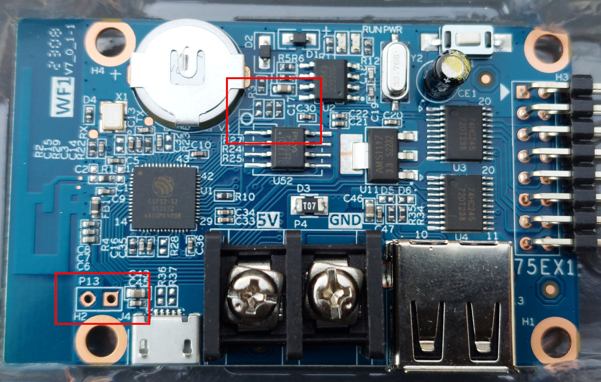
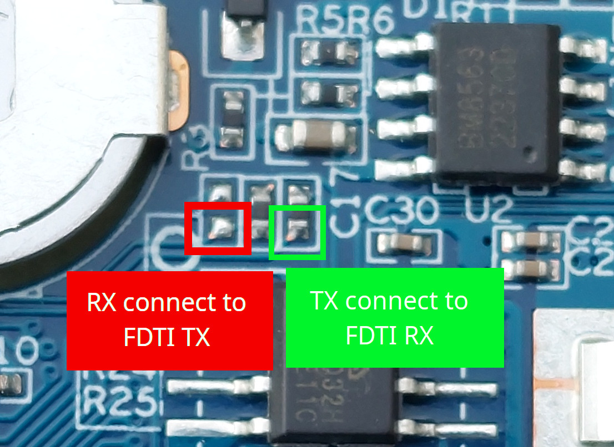

# HD-WF1-LED-MatrixPanel-DMA
 Custom firmware based on my [HUB75 DMA library](https://github.com/mrfaptastic/ESP32-HUB75-MatrixPanel-DMA),  for the Huidu WF1 LED Controller Card based on the ESP32-S2.

 These can be bought for about $5 bucks and are quite good. Come with a battery and a Real Time Clock.
 
 https://www.aliexpress.com/item/1005005038544582.html 
 
 ## How to flash?
 
 You'll need a FTDI card to flash, carefully connect the RX pin on the PCB to the TX pin of your FTDI serial flasher. And the TX pin on the PCB to the RX pin of the FTDI device.
 
 Then bridge the two pins near the micro-USB port and power-cycle the PCB to get the device into Firmware Download mode.
 
 Write the firmware using Arduino or PlatformIO. 
 
 
 
 
 
 
